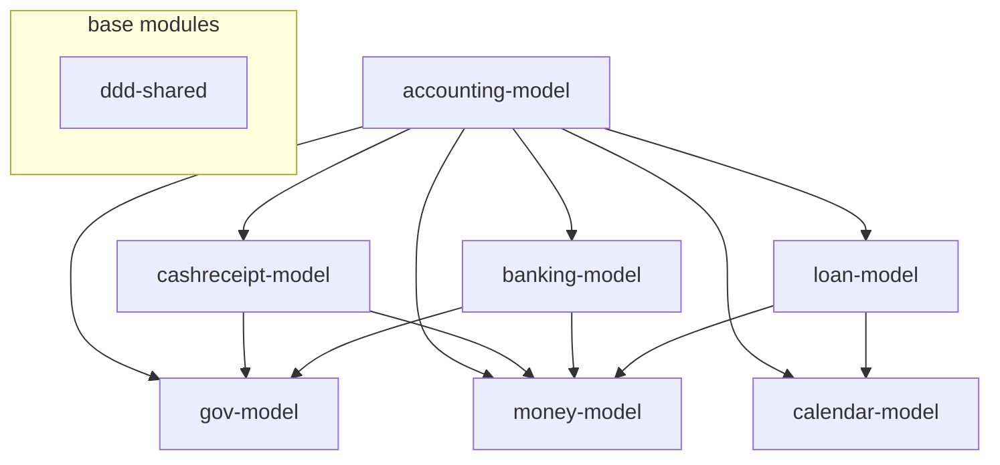

```mermaid
flowchart TD

    banking-model --> gov-model;
    
    loan-model --> money-model;
    loan-model --> calendar-model;

    banking-model --> money-model;
    
    cashreceipt-model --> gov-model;
    cashreceipt-model --> money-model;

    accounting-model --> gov-model;
    accounting-model --> money-model;
    accounting-model --> loan-model;
    accounting-model --> banking-model;
    accounting-model --> calendar-model;
    accounting-model --> cashreceipt-model;
    
    subgraph base modules
        ddd-shared;
    end
```
